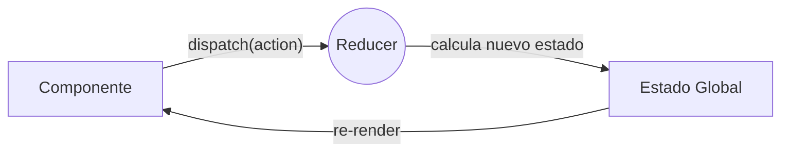

# Trabajo Práctico N° 5: Gestión de Estado Avanzado
## "useReducer + Context: Escalando la Lógica de Negocio"

Cuando una aplicación crece, manejar el estado con simples `useState` se vuelve un dolor de cabeza. La lógica se dispersa, los componentes se llenan de funciones y el mantenimiento se vuelve una pesadilla. Acá es donde entra **useReducer**.

---

## 🎯 Objetivos del Práctico
*   **Migración:** Reemplazar `useState` por `useReducer` para la gestión de participantes.
*   **Centralización:** Agrupar toda la lógica de manipulación de datos en un solo lugar (el Reducer).
*   **Inyección de Dependencias:** Integrar el Reducer con **Context API** para evitar el "Prop Drilling".
*   **Persistencia:** Asegurar que los cambios impacten correctamente en el Backend y la Base de Datos.

---

## 🧠 Concepto Clave: El Patrón Reducer
En lugar de modificar el estado directamente (`setEstado(nuevo)`), enviamos **acciones** que describen una intención. El Reducer es quien decide, basado en esa acción, cómo debe transformarse el estado.

### El Flujo de Datos


### Componentes del Patrón
1.  **State:** El valor actual de nuestra "verdad" (la lista de participantes).
2.  **Action:** Un objeto que dice qué queremos hacer. Ejemplo: `{ type: "ELIMINAR", payload: 5 }`.
3.  **Reducer:** La función pura que recibe el estado actual + la acción y devuelve el nuevo estado.
4.  **Dispatch:** La "mensajería" que envía la acción al Reducer.

---

## 🛠 Implementación: `participantesReducer`

El reducer debe manejar todas las operaciones CRUD y de sincronización con el servidor. Las acciones principales son:

```typescript
export type Action =
  | { type: "GET_PARTICIPANTES"; payload: Participante[] } // Carga inicial
  | { type: "AGREGAR"; payload: Participante }            // Nuevo ingreso
  | { type: "ELIMINAR"; payload: number }                  // Borrado por ID
  | { type: "EDITAR"; payload: Participante }            // Actualización
  | { type: "SET"; payload: Participante[] }               // Seteo forzado
  | { type: "RESET"; payload: Participante[] };            // Limpieza/Reset
```

---

## 🚀 El Desafío: Funcionalidad de Edición

La gran novedad de este TP es la **Edición de Participantes**. El flujo debe ser:

1.  **Captura:** Al hacer clic en "Editar", el participante seleccionado se debe cargar en el formulario global.
2.  **UX Dinámica:** El botón del formulario debe cambiar su texto (ej: de "Registrar" a "Guardar Cambios") para indicar que estamos en modo edición.
3.  **Persistencia:** Al guardar, se debe disparar una petición `PUT` al backend.
4.  **Sincronización:** El Reducer debe actualizar solo el elemento modificado en el estado local para que la tarjeta se refresque instantáneamente.

> [!TIP]
> **Mejora de UX:** Cambiar el color del botón o agregar un botón "Cancelar Edición" ayuda mucho a que el usuario no se sienta perdido.

---
**Recuerda:** "En lugar de modificar el estado directamente, enviamos acciones que el reducer procesa." ¡Esa es la base de una arquitectura sólida!
